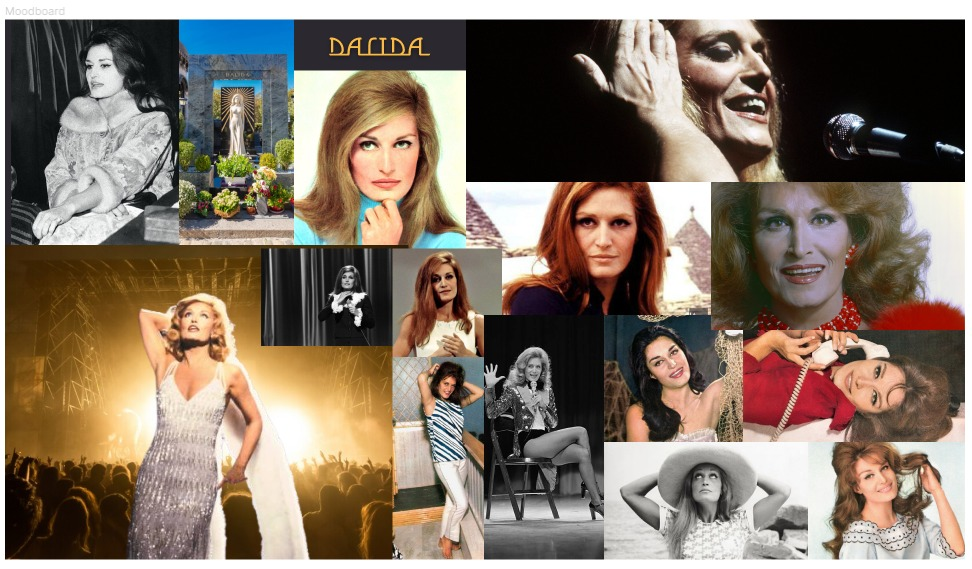
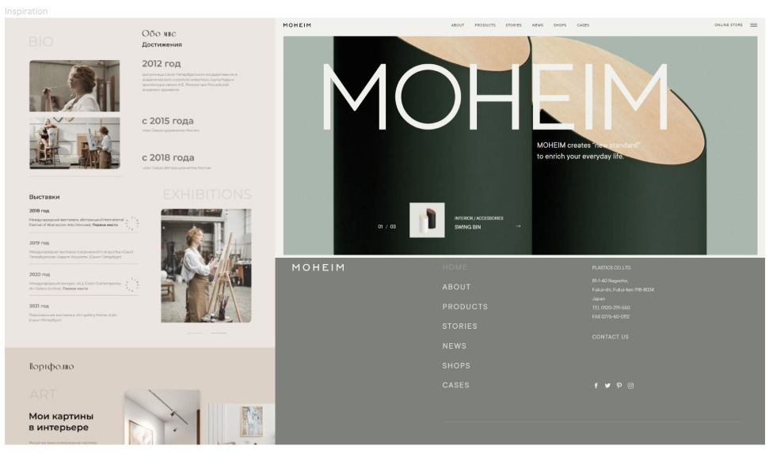

Projet 1 : DALIDA 
------------------------------
 A.1.a : Analyse 
---------------------------------------
  Who is Dalida?

Is a born 17 January 1933 in cairo ,capital for Egypt
Is an Italian-French singer and actress . A polyglot artist, she understood five languages ​​and interpreted her songs in eleven languages, namely German, Egyptian Arabic, English, Lebanese Arabic, Spanish, French, Greek, Hebrew, Italian, Japanese and Dutch.

After several million records sold around the world and various international tours, she decided to end her life on May 3, 1987, tormented by important dramas that marked her life.

 A.1.b :Visual identity 
 ---------------------------------------------
  What did Dalida do?

First an actress, she made her debut in the film A Glass and a Cigarette by Niazi Mustapha in 1955, shot in the Valley of the Kings, in the tombs of the pharaohs. One year later, having signed with the Barclay record company, Dalida achieved her first success as a singer with Bambino. Following which, she became the most important seller of records in France between 1957 and 1961. She will remain a major artist in this country.

In addition, she enjoyed international success in 1959. Indeed, throughout her career and on several occasions, she ranked in many countries, whether in Europe, Latin America, North America, or still in Asia. Among her greatest sales successes: "Le jour où la pluie viendra", "Gigi l'amoroso", "J'attendrai".

Although she has shot a few films alongside her career as a singer, she effectively reconnects with cinema with The Sixth Day, a film by Youssef Chahine released in 1986. The latter was successful in Egypt. Three million people will mobilize in Shubra on the day of the preview; Dalida having made the trip. Nevertheless, the film will only remain a success of esteem in France.

A.1.b : Digital strategy 
----------------------------------------
A website exists forthe biography of the artist

the website is : Dalida site Officiel

A.2 : Cahier des charges 
------------------------------------------
esraa3012 :is a freelance developer. Its goal is to make the web easy, modern and accessible to everyone.

The target of the website: The general public who appreciates the music and cinema . All fans of Dalida musical and cinema.

State of the existing : Dalida has an official website “https://dalida.com/”

Site tree : A biography 

music

cinema

photos

Functional description : the homepage for subscription to a newsletter.

Gallery.

Contact form.

Back office page.

A.3 : Planche de tendance
-------------------------------------

Moodboard

Inspiration

A.4 Design System
-------------------------------------
A.5 design for the header
-------------------------------------
A.6 wireframe for the main
------------------------------------
A.7 design for the main
--------------------------------------
A.8 design for the footer
-------------------------------------
A.9 Responsive
--------------------------------------